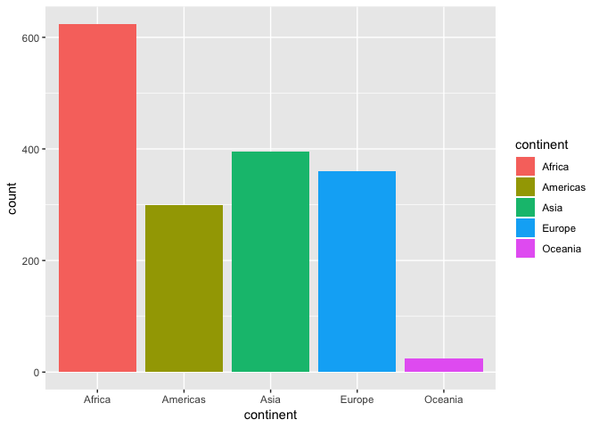
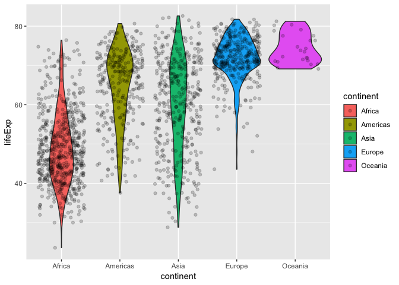
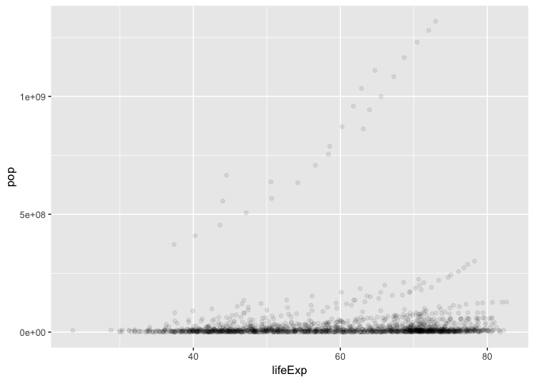
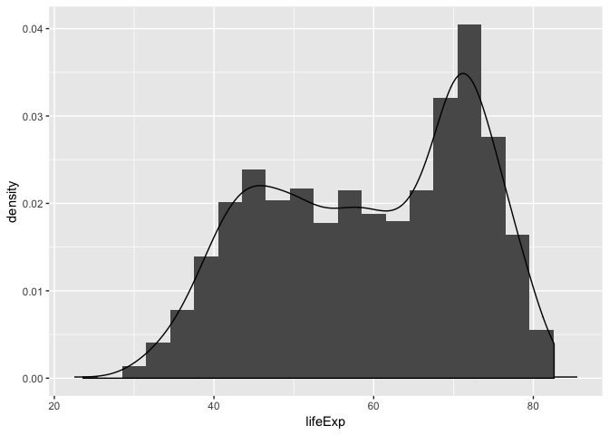
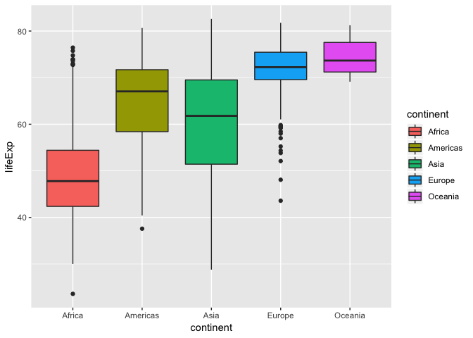
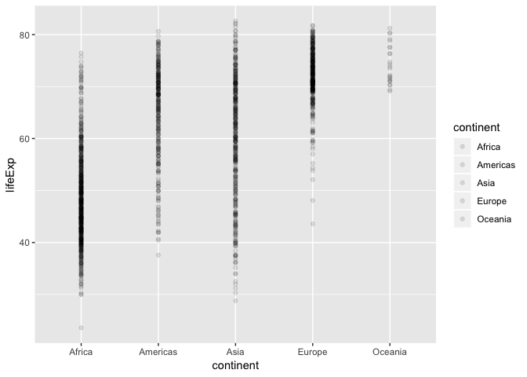
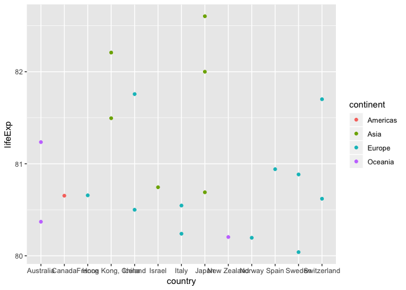

hw02\_gapminder
================

Including packages:
-------------------

``` r
library(gapminder)
library(tidyverse)
```

    ## ── Attaching packages ────────────────────────────────── tidyverse 1.2.1 ──

    ## ✔ ggplot2 3.0.0     ✔ purrr   0.2.5
    ## ✔ tibble  1.4.2     ✔ dplyr   0.7.6
    ## ✔ tidyr   0.8.1     ✔ stringr 1.3.1
    ## ✔ readr   1.1.1     ✔ forcats 0.3.0

    ## ── Conflicts ───────────────────────────────────── tidyverse_conflicts() ──
    ## ✖ dplyr::filter() masks stats::filter()
    ## ✖ dplyr::lag()    masks stats::lag()

Explore the gapminder object:
-----------------------------

1.Is it a data.frame, a matrix, a vector, a list?

``` r
is.data.frame(gapminder)
```

    ## [1] TRUE

``` r
is.matrix(gapminder)
```

    ## [1] FALSE

``` r
is.vector(gapminder)
```

    ## [1] FALSE

``` r
is.list(gapminder)
```

    ## [1] TRUE

-The results shows that the gapminder is a data.frame, also a list.

2.What is its class?

``` r
class(gapminder)
```

    ## [1] "tbl_df"     "tbl"        "data.frame"

3.Number of variables/columns:

``` r
ncol(gapminder)
```

    ## [1] 6

4.Number of rows/observations:

``` r
nrow(gapminder)
```

    ## [1] 1704

5.Can you get these facts about “extent” or “size” in more than one way?

The number of columns can also be obtained with the length() function:

``` r
length(gapminder)
```

    ## [1] 6

Besides, the dim() function is able to give both the number of rows and columns:

``` r
dim(gapminder)
```

    ## [1] 1704    6

Can you imagine different functions being useful in different contexts?

The str() function is used to examine data.frame. From the result we can get the number of observations and variables. Which also shows the type of each variables:

``` r
str(gapminder)
```

    ## Classes 'tbl_df', 'tbl' and 'data.frame':    1704 obs. of  6 variables:
    ##  $ country  : Factor w/ 142 levels "Afghanistan",..: 1 1 1 1 1 1 1 1 1 1 ...
    ##  $ continent: Factor w/ 5 levels "Africa","Americas",..: 3 3 3 3 3 3 3 3 3 3 ...
    ##  $ year     : int  1952 1957 1962 1967 1972 1977 1982 1987 1992 1997 ...
    ##  $ lifeExp  : num  28.8 30.3 32 34 36.1 ...
    ##  $ pop      : int  8425333 9240934 10267083 11537966 13079460 14880372 12881816 13867957 16317921 22227415 ...
    ##  $ gdpPercap: num  779 821 853 836 740 ...

6.What data type is each variable? Apart from the str(), the sapply() function specifically gives the data type of each variable:

``` r
sapply(gapminder, typeof)
```

    ##   country continent      year   lifeExp       pop gdpPercap 
    ## "integer" "integer" "integer"  "double" "integer"  "double"

Explore individual variables:
-----------------------------

### The categorical variable I picked is continent.

Possible values of continent?

``` r
levels(gapminder$continent)
```

    ## [1] "Africa"   "Americas" "Asia"     "Europe"   "Oceania"

The frequency of each continent:

``` r
summary(gapminder$continent)
```

    ##   Africa Americas     Asia   Europe  Oceania 
    ##      624      300      396      360       24

The barchart is able to visualize the table above:

``` r
ggplot(data=gapminder, aes(continent, fill=continent)) +
  geom_bar()
```



Propotions of each fequency:

``` r
table <- table(gapminder$continent)
prop.table(table)
```

    ## 
    ##     Africa   Americas       Asia     Europe    Oceania 
    ## 0.36619718 0.17605634 0.23239437 0.21126761 0.01408451

### The categorical variable I picked is lifeExp.

Distinct values of 'lifeExp':

``` r
unique(gapminder$lifeExp)
```

    ##    [1] 28.80100 30.33200 31.99700 34.02000 36.08800 38.43800 39.85400
    ##    [8] 40.82200 41.67400 41.76300 42.12900 43.82800 55.23000 59.28000
    ##   [15] 64.82000 66.22000 67.69000 68.93000 70.42000 72.00000 71.58100
    ##   [22] 72.95000 75.65100 76.42300 43.07700 45.68500 48.30300 51.40700
    ##   [29] 54.51800 58.01400 61.36800 65.79900 67.74400 69.15200 70.99400
    ##   [36] 72.30100 30.01500 31.99900 34.00000 35.98500 37.92800 39.48300
    ##   [43] 39.94200 39.90600 40.64700 40.96300 41.00300 42.73100 62.48500
    ##   [50] 64.39900 65.14200 65.63400 67.06500 68.48100 69.94200 70.77400
    ##   [57] 71.86800 73.27500 74.34000 75.32000 69.12000 70.33000 70.93000
    ##   [64] 71.10000 71.93000 73.49000 74.74000 76.32000 77.56000 78.83000
    ##   [71] 80.37000 81.23500 66.80000 67.48000 69.54000 70.14000 70.63000
    ##   [78] 72.17000 73.18000 74.94000 76.04000 77.51000 78.98000 79.82900
    ##   [85] 50.93900 53.83200 56.92300 59.92300 63.30000 65.59300 69.05200
    ##   [92] 70.75000 72.60100 73.92500 74.79500 75.63500 37.48400 39.34800
    ##   [99] 41.21600 43.45300 45.25200 46.92300 50.00900 52.81900 56.01800
    ##  [106] 59.41200 62.01300 64.06200 68.00000 69.24000 70.25000 70.94000
    ##  [113] 71.44000 72.80000 73.93000 75.35000 76.46000 77.53000 78.32000
    ##  [120] 79.44100 38.22300 40.35800 42.61800 44.88500 47.01400 49.19000
    ##  [127] 50.90400 52.33700 53.91900 54.77700 54.40600 56.72800 40.41400
    ##  [134] 41.89000 43.42800 45.03200 46.71400 50.02300 53.85900 57.25100
    ##  [141] 59.95700 62.05000 63.88300 65.55400 53.82000 58.45000 61.93000
    ##  [148] 64.79000 67.45000 69.86000 70.69000 71.14000 72.17800 73.24400
    ##  [155] 74.09000 74.85200 47.62200 49.61800 51.52000 53.29800 56.02400
    ##  [162] 59.31900 61.48400 63.62200 62.74500 52.55600 46.63400 50.72800
    ##  [169] 50.91700 53.28500 55.66500 57.63200 59.50400 61.48900 63.33600
    ##  [176] 65.20500 67.05700 69.38800 71.00600 72.39000 59.60000 66.61000
    ##  [183] 69.51000 70.90000 70.81000 71.08000 71.34000 71.19000 70.32000
    ##  [190] 72.14000 73.00500 31.97500 34.90600 37.81400 40.69700 43.59100
    ##  [197] 46.13700 48.12200 49.55700 50.26000 50.32400 50.65000 52.29500
    ##  [204] 39.03100 40.53300 42.04500 43.54800 44.05700 45.91000 47.47100
    ##  [211] 48.21100 44.73600 45.32600 47.36000 49.58000 39.41700 41.36600
    ##  [218] 43.41500 45.41500 40.31700 31.22000 50.95700 53.91400 55.80300
    ##  [225] 56.53400 56.75200 59.72300 38.52300 40.42800 42.64300 44.79900
    ##  [232] 47.04900 49.35500 52.96100 54.98500 54.31400 52.19900 49.85600
    ##  [239] 50.43000 68.75000 69.96000 71.30000 72.13000 72.88000 74.21000
    ##  [246] 75.76000 76.86000 77.95000 78.61000 79.77000 80.65300 35.46300
    ##  [253] 37.46400 39.47500 41.47800 43.45700 46.77500 48.29500 50.48500
    ##  [260] 49.39600 46.06600 43.30800 44.74100 38.09200 39.88100 41.71600
    ##  [267] 43.60100 45.56900 47.38300 49.51700 51.05100 51.72400 51.57300
    ##  [274] 50.52500 50.65100 54.74500 56.07400 57.92400 60.52300 63.44100
    ##  [281] 67.05200 70.56500 72.49200 74.12600 75.81600 77.86000 78.55300
    ##  [288] 44.00000 50.54896 44.50136 58.38112 63.11888 63.96736 65.52500
    ##  [295] 67.27400 68.69000 70.42600 72.02800 72.96100 50.64300 55.11800
    ##  [302] 57.86300 59.96300 61.62300 63.83700 66.65300 67.76800 68.42100
    ##  [309] 70.31300 71.68200 72.88900 40.71500 42.46000 44.46700 46.47200
    ##  [316] 48.94400 52.93300 54.92600 57.93900 60.66000 62.97400 65.15200
    ##  [323] 39.14300 40.65200 42.12200 44.05600 45.98900 47.80400 47.78400
    ##  [330] 47.41200 45.54800 42.58700 44.96600 46.46200 42.11100 45.05300
    ##  [337] 48.43500 52.04000 54.90700 55.62500 56.69500 57.47000 56.43300
    ##  [344] 52.96200 52.97000 55.32200 57.20600 60.02600 62.84200 65.42400
    ##  [351] 67.84900 73.45000 74.75200 75.71300 77.26000 78.12300 78.78200
    ##  [358] 40.47700 42.46900 44.93000 47.35000 49.80100 52.37400 53.98300
    ##  [365] 54.65500 52.04400 47.99100 46.83200 48.32800 61.21000 64.77000
    ##  [372] 67.13000 68.50000 69.61000 70.64000 70.46000 71.52000 72.52700
    ##  [379] 73.68000 74.87600 75.74800 59.42100 62.32500 65.24600 68.29000
    ##  [386] 70.72300 72.64900 73.71700 74.17400 74.41400 76.15100 77.15800
    ##  [393] 78.27300 66.87000 69.03000 69.90000 70.38000 70.29000 70.71000
    ##  [400] 70.96000 71.58000 72.40000 74.01000 75.51000 76.48600 70.78000
    ##  [407] 71.81000 72.35000 72.96000 73.47000 74.69000 74.63000 74.80000
    ##  [414] 75.33000 76.11000 77.18000 78.33200 34.81200 37.32800 39.69300
    ##  [421] 42.07400 44.36600 46.51900 48.81200 50.04000 51.60400 53.15700
    ##  [428] 53.37300 54.79100 45.92800 49.82800 53.45900 56.75100 59.63100
    ##  [435] 61.78800 63.72700 66.04600 68.45700 69.95700 70.84700 72.23500
    ##  [442] 48.35700 51.35600 54.64000 56.67800 58.79600 61.31000 64.34200
    ##  [449] 67.23100 69.61300 72.31200 74.17300 74.99400 41.89300 44.44400
    ##  [456] 46.99200 49.29300 51.13700 53.31900 56.00600 59.79700 63.67400
    ##  [463] 67.21700 69.80600 71.33800 45.26200 48.57000 52.30700 55.85500
    ##  [470] 58.20700 56.69600 56.60400 63.15400 66.79800 69.53500 70.73400
    ##  [477] 71.87800 34.48200 35.98300 37.48500 38.98700 40.51600 42.02400
    ##  [484] 43.66200 45.66400 47.54500 48.24500 49.34800 51.57900 35.92800
    ##  [491] 38.04700 40.15800 42.18900 44.14200 44.53500 43.89000 46.45300
    ##  [498] 49.99100 53.37800 55.24000 58.04000 34.07800 36.66700 40.05900
    ##  [505] 42.11500 43.51500 44.51000 44.91600 46.68400 48.09100 49.40200
    ##  [512] 50.72500 52.94700 66.55000 67.49000 69.83000 70.87000 72.52000
    ##  [519] 74.55000 74.83000 75.70000 77.13000 78.37000 79.31300 67.41000
    ##  [526] 70.51000 71.55000 72.38000 73.83000 74.89000 76.34000 77.46000
    ##  [533] 78.64000 79.59000 80.65700 37.00300 38.99900 40.48900 44.59800
    ##  [540] 48.69000 52.79000 56.56400 60.19000 61.36600 60.46100 56.76100
    ##  [547] 56.73500 30.00000 32.06500 33.89600 35.85700 38.30800 41.84200
    ##  [554] 45.58000 49.26500 52.64400 55.86100 58.04100 59.44800 67.50000
    ##  [561] 69.10000 70.30000 70.80000 71.00000 72.50000 73.80000 74.84700
    ##  [568] 76.07000 77.34000 78.67000 79.40600 43.14900 44.77900 46.45200
    ##  [575] 48.07200 49.87500 51.75600 53.74400 55.72900 57.50100 58.55600
    ##  [582] 58.45300 60.02200 65.86000 67.86000 72.34000 75.24000 76.67000
    ##  [589] 77.03000 77.86900 78.25600 79.48300 42.02300 46.95400 50.01600
    ##  [596] 53.73800 56.02900 58.13700 60.78200 63.37300 66.32200 68.97800
    ##  [603] 70.25900 33.60900 34.55800 35.75300 37.19700 38.84200 40.76200
    ##  [610] 42.89100 45.55200 48.57600 51.45500 53.67600 56.00700 32.50000
    ##  [617] 33.48900 34.48800 35.49200 36.48600 37.46500 39.32700 41.24500
    ##  [624] 43.26600 44.87300 45.50400 46.38800 37.57900 40.69600 43.59000
    ##  [631] 46.24300 48.04200 49.92300 51.46100 53.63600 55.08900 56.67100
    ##  [638] 60.91600 41.91200 44.66500 48.04100 50.92400 53.88400 57.40200
    ##  [645] 60.90900 64.49200 66.39900 67.65900 68.56500 70.19800 60.96000
    ##  [652] 64.75000 67.65000 70.00000 73.60000 75.45000 76.20000 77.60100
    ##  [659] 80.00000 81.49500 82.20800 64.03000 66.41000 67.96000 69.50000
    ##  [666] 69.76000 69.95000 69.39000 69.58000 69.17000 71.04000 72.59000
    ##  [673] 73.33800 72.49000 73.73000 74.46000 76.99000 77.23000 78.77000
    ##  [680] 78.95000 80.50000 81.75700 37.37300 40.24900 43.60500 47.19300
    ##  [687] 54.20800 56.59600 58.55300 60.22300 61.76500 62.87900 64.69800
    ##  [694] 37.46800 39.91800 42.51800 45.96400 49.20300 52.70200 56.15900
    ##  [701] 60.13700 62.68100 66.04100 68.58800 70.65000 44.86900 47.18100
    ##  [708] 49.32500 52.46900 55.23400 57.70200 59.62000 63.04000 65.74200
    ##  [715] 68.04200 69.45100 70.96400 45.32000 48.43700 51.45700 54.45900
    ##  [722] 56.95000 60.41300 62.03800 65.04400 59.46100 58.81100 57.04600
    ##  [729] 59.54500 66.91000 68.90000 71.28000 72.03000 73.10000 74.36000
    ##  [736] 75.46700 76.12200 77.78300 78.88500 65.39000 67.84000 71.63000
    ##  [743] 73.06000 74.45000 75.60000 76.93000 78.26900 79.69600 80.74500
    ##  [750] 65.94000 67.81000 71.06000 72.19000 73.48000 74.98000 76.42000
    ##  [757] 77.44000 78.82000 80.24000 80.54600 58.53000 62.61000 65.61000
    ##  [764] 67.51000 69.00000 70.11000 71.21000 71.77000 71.76600 72.26200
    ##  [771] 72.04700 72.56700 63.03000 65.50000 68.73000 71.43000 73.42000
    ##  [778] 75.38000 77.11000 79.36000 80.69000 82.00000 82.60300 43.15800
    ##  [785] 45.66900 48.12600 51.62900 56.52800 61.13400 63.73900 65.86900
    ##  [792] 68.01500 69.77200 71.26300 72.53500 42.27000 44.68600 47.94900
    ##  [799] 50.65400 53.55900 56.15500 58.76600 59.33900 59.28500 54.40700
    ##  [806] 50.99200 54.11000 50.05600 54.08100 56.65600 59.94200 63.98300
    ##  [813] 67.15900 70.64700 69.97800 67.72700 66.66200 67.29700 47.45300
    ##  [820] 52.68100 55.29200 57.71600 62.61200 64.76600 67.12300 69.81000
    ##  [827] 72.24400 74.64700 77.04500 78.62300 55.56500 58.03300 60.47000
    ##  [834] 64.62400 67.71200 69.34300 71.30900 75.19000 76.15600 76.90400
    ##  [841] 77.58800 55.92800 59.48900 62.09400 63.87000 65.42100 66.09900
    ##  [848] 66.98300 67.92600 69.29200 70.26500 71.02800 71.99300 42.13800
    ##  [855] 45.04700 47.74700 48.49200 49.76700 52.20800 55.07800 57.18000
    ##  [862] 59.68500 55.55800 44.59300 42.59200 38.48000 39.48600 40.50200
    ##  [869] 41.53600 42.61400 43.76400 44.85200 46.02700 40.80200 42.22100
    ##  [876] 43.75300 45.67800 42.72300 45.28900 47.80800 50.22700 52.77300
    ##  [883] 57.44200 62.15500 66.23400 68.75500 71.55500 72.73700 73.95200
    ##  [890] 36.68100 38.86500 40.84800 42.88100 44.85100 46.88100 48.96900
    ##  [897] 49.35000 52.21400 54.97800 57.28600 59.44300 36.25600 37.20700
    ##  [904] 38.41000 39.48700 41.76600 43.76700 45.64200 47.45700 49.42000
    ##  [911] 47.49500 45.00900 48.46300 52.10200 55.73700 59.37100 63.01000
    ##  [918] 65.25600 70.69300 71.93800 73.04400 74.24100 33.68500 35.30700
    ##  [925] 36.93600 38.48700 39.97700 41.71400 43.91600 46.36400 48.38800
    ##  [932] 49.90300 51.81800 54.46700 40.54300 42.33800 44.24800 46.28900
    ##  [939] 50.85200 53.59900 56.14500 58.33300 60.43000 62.24700 64.16400
    ##  [946] 50.98600 58.08900 60.24600 61.55700 62.94400 64.93000 66.71100
    ##  [953] 68.74000 69.74500 70.73600 71.95400 72.80100 50.78900 55.19000
    ##  [960] 58.29900 60.11000 62.36100 65.03200 67.40500 69.49800 71.45500
    ##  [967] 73.67000 74.90200 76.19500 42.24400 45.24800 48.25100 51.25300
    ##  [974] 53.75400 55.49100 57.48900 60.22200 61.27100 63.62500 65.03300
    ##  [981] 66.80300 59.16400 61.44800 63.72800 67.17800 70.63600 73.06600
    ##  [988] 74.10100 74.86500 75.43500 75.44500 73.98100 74.54300 42.87300
    ##  [995] 45.42300 47.92400 50.33500 52.86200 55.73000 59.65000 62.67700
    ## [1002] 65.39300 67.66000 69.61500 71.16400 31.28600 33.77900 36.16100
    ## [1009] 38.11300 40.32800 42.49500 42.79500 42.86100 44.28400 46.34400
    ## [1016] 44.02600 42.08200 36.31900 41.90500 45.10800 49.37900 53.07000
    ## [1023] 56.05900 58.05600 58.33900 59.32000 60.32800 59.90800 62.06900
    ## [1030] 41.72500 45.22600 48.38600 51.15900 53.86700 56.43700 58.96800
    ## [1037] 60.83500 61.99900 58.90900 51.47900 52.90600 36.15700 37.68600
    ## [1044] 39.39300 41.47200 43.97100 46.74800 49.59400 52.53700 55.72700
    ## [1051] 59.42600 61.34000 63.78500 72.99000 73.23000 73.82000 73.75000
    ## [1058] 76.05000 76.83000 77.42000 78.03000 78.53000 79.76200 70.26000
    ## [1065] 71.24000 71.89000 72.22000 73.84000 74.32000 76.33000 77.55000
    ## [1072] 79.11000 80.20400 42.31400 45.43200 48.63200 51.88400 55.15100
    ## [1079] 59.29800 62.00800 65.84300 68.42600 70.83600 72.89900 37.44400
    ## [1086] 38.59800 40.11800 40.54600 41.29100 42.59800 44.55500 47.39100
    ## [1093] 51.31300 54.49600 56.86700 36.32400 37.80200 39.36000 41.04000
    ## [1100] 42.82100 44.51400 45.82600 46.88600 47.47200 47.46400 46.60800
    ## [1107] 46.85900 72.67000 73.44000 74.08000 75.37000 75.97000 75.89000
    ## [1114] 77.32000 79.05000 80.19600 37.57800 40.08000 43.16500 46.98800
    ## [1121] 52.14300 57.36700 62.72800 67.73400 71.19700 72.49900 74.19300
    ## [1128] 75.64000 43.43600 45.55700 47.67000 49.80000 51.92900 54.04300
    ## [1135] 56.15800 58.24500 60.83800 61.81800 63.61000 65.48300 55.19100
    ## [1142] 59.20100 61.81700 64.07100 66.21600 68.68100 70.47200 71.52300
    ## [1149] 72.46200 73.73800 74.71200 75.53700 62.64900 63.19600 64.36100
    ## [1156] 64.95100 65.81500 66.35300 66.87400 67.37800 68.22500 69.40000
    ## [1163] 70.75500 71.75200 43.90200 46.26300 49.09600 51.44500 55.44800
    ## [1170] 58.44700 61.40600 64.13400 66.45800 68.38600 69.90600 71.42100
    ## [1177] 47.75200 51.33400 54.75700 56.39300 58.06500 60.06000 62.08200
    ## [1184] 64.15100 68.56400 70.30300 71.68800 65.77000 67.64000 70.85000
    ## [1191] 70.67000 71.32000 70.98000 70.99000 72.75000 74.67000 75.56300
    ## [1198] 59.82000 61.51000 64.39000 66.60000 69.26000 70.41000 72.77000
    ## [1205] 74.06000 74.86000 77.29000 78.09800 64.28000 68.54000 69.62000
    ## [1212] 72.16000 73.91100 74.91700 77.77800 78.74600 52.72400 55.09000
    ## [1219] 57.66600 60.54200 64.27400 67.06400 69.88500 71.91300 73.61500
    ## [1226] 74.77200 75.74400 76.44200 61.05000 64.10000 69.21000 69.46000
    ## [1233] 69.66000 69.53000 69.36000 69.72000 71.32200 72.47600 40.00000
    ## [1240] 41.50000 43.00000 44.10000 44.60000 45.00000 46.21800 44.02000
    ## [1247] 23.59900 36.08700 43.41300 46.24200 46.47100 48.94500 51.89300
    ## [1254] 54.42500 56.48000 58.55000 60.35100 61.72800 62.74200 63.30600
    ## [1261] 64.33700 65.52800 39.87500 42.86800 45.91400 49.90100 53.88600
    ## [1268] 58.69000 63.01200 66.29500 68.76800 70.53300 71.62600 72.77700
    ## [1275] 37.27800 39.32900 41.45400 43.56300 45.81500 48.87900 52.37900
    ## [1282] 55.76900 58.19600 60.18700 61.60000 63.06200 57.99600 61.68500
    ## [1289] 64.53100 66.91400 68.70000 70.16200 71.21800 71.65900 72.23200
    ## [1296] 73.21300 74.00200 30.33100 31.57000 32.76700 34.11300 35.40000
    ## [1303] 36.78800 38.44500 40.00600 38.33300 39.89700 41.01200 42.56800
    ## [1310] 60.39600 63.17900 65.79800 67.94600 69.52100 70.79500 71.76000
    ## [1317] 73.56000 75.78800 79.97200 64.36000 70.35000 70.45000 71.38000
    ## [1324] 72.71000 74.66300 65.57000 67.85000 69.15000 69.18000 69.82000
    ## [1331] 70.97000 71.06300 72.25000 73.64000 75.13000 76.66000 77.92600
    ## [1338] 32.97800 34.97700 36.98100 38.97700 40.97300 41.97400 42.95500
    ## [1345] 44.50100 39.65800 43.79500 45.93600 48.15900 47.98500 49.95100
    ## [1352] 51.92700 53.69600 55.52700 58.16100 60.83400 61.88800 60.23600
    ## [1359] 53.36500 49.33900 64.94000 66.66000 69.69000 74.39000 76.30000
    ## [1366] 76.90000 77.57000 79.78000 80.94100 57.59300 61.45600 62.19200
    ## [1373] 64.26600 65.04200 65.94900 68.75700 69.01100 70.37900 70.45700
    ## [1380] 70.81500 72.39600 38.63500 39.62400 40.87000 42.85800 45.08300
    ## [1387] 47.80000 50.33800 51.74400 53.55600 55.37300 56.36900 41.40700
    ## [1394] 43.42400 44.99200 46.63300 49.55200 55.56100 57.67800 58.47400
    ## [1401] 54.28900 43.86900 39.61300 71.86000 73.37000 74.16000 74.72000
    ## [1408] 75.44000 77.19000 78.16000 79.39000 80.04000 80.88400 70.56000
    ## [1415] 73.78000 75.39000 76.21000 77.41000 79.37000 80.62000 81.70100
    ## [1422] 45.88300 48.28400 50.30500 53.65500 57.29600 61.19500 64.59000
    ## [1429] 66.97400 69.24900 71.52700 73.05300 74.14300 58.50000 62.40000
    ## [1436] 65.20000 70.59000 73.40000 74.26000 75.25000 78.40000 41.21500
    ## [1443] 42.97400 44.24600 45.75700 47.62000 49.91900 50.60800 51.53500
    ## [1450] 50.44000 48.46600 49.65100 52.51700 50.84800 53.63000 56.06100
    ## [1457] 58.28500 60.40500 62.49400 64.59700 66.08400 67.29800 67.52100
    ## [1464] 70.61600 38.59600 41.20800 43.92200 46.76900 49.75900 52.88700
    ## [1471] 55.47100 56.94100 58.06100 58.39000 57.56100 58.42000 59.10000
    ## [1478] 61.80000 64.90000 65.40000 65.90000 68.30000 68.83200 69.58200
    ## [1485] 69.86200 69.46500 68.97600 69.81900 47.10000 49.57900 52.05300
    ## [1492] 55.60200 59.83700 64.04800 66.89400 70.00100 71.97300 73.04200
    ## [1499] 73.92300 43.58500 48.07900 52.09800 54.33600 57.00500 59.50700
    ## [1506] 61.03600 63.10800 66.14600 68.83500 70.84500 71.77700 39.97800
    ## [1513] 42.57100 45.34400 48.05100 51.01600 50.35000 49.84900 51.50900
    ## [1520] 48.82500 44.57800 47.81300 51.54200 70.76000 71.36000 72.01000
    ## [1527] 72.76000 74.04000 75.00700 77.21800 78.47100 79.42500 68.44000
    ## [1534] 69.49000 70.21000 73.38000 74.65000 75.02000 76.09000 76.81000
    ## [1541] 77.31000 78.24200 66.07100 67.04400 68.25300 68.46800 68.67300
    ## [1548] 69.48100 70.80500 71.91800 72.75200 74.22300 75.30700 76.38400
    ## [1555] 55.08800 57.90700 60.77000 63.47900 65.71200 67.45600 68.55700
    ## [1562] 70.19000 71.15000 72.14600 72.76600 73.74700 40.41200 42.88700
    ## [1569] 45.36300 47.83800 50.25400 55.76400 58.81600 62.82000 67.66200
    ## [1576] 70.67200 73.01700 74.24900 43.16000 45.67100 48.12700 51.63100
    ## [1583] 56.53200 60.76500 64.40600 67.04600 69.71800 71.09600 72.37000
    ## [1590] 73.42200 32.54800 33.97000 35.18000 36.98400 39.84800 44.17500
    ## [1597] 49.11300 52.92200 55.59900 58.02000 60.30800 62.69800 42.03800
    ## [1604] 44.07700 46.02300 47.76800 50.10700 51.38600 51.82100 50.82100
    ## [1611] 46.10000 40.23800 39.19300 42.38400 48.45100 50.46900 52.35800
    ## [1618] 53.99500 55.63500 57.67400 60.36300 62.35100 60.37700 46.80900
    ## [1625] 39.98900 43.48700

The typical values of lifeExp:

``` r
summary(gapminder$lifeExp)
```

    ##    Min. 1st Qu.  Median    Mean 3rd Qu.    Max. 
    ##   23.60   48.20   60.71   59.47   70.85   82.60

Range:

``` r
diff(range(gapminder$lifeExp))
```

    ## [1] 59.004

Variance:

``` r
var(gapminder$lifeExp)
```

    ## [1] 166.8517

Standard deviation:

``` r
sd(gapminder$lifeExp)
```

    ## [1] 12.91711

Try the combination of violin and jitter graph on lifeExp and continent:

``` r
ggplot(gapminder, aes(continent, lifeExp, fill=continent)) +  
  geom_violin() + 
  geom_jitter(alpha=0.2)
```



Explore various plot types:
---------------------------

A scatterplot of two quantitative variables(lifeExp and pop)

``` r
ggplot(gapminder, aes(lifeExp, pop)) + geom_point(alpha=0.08)
```



A plot of one quantitative variable. (A histogram and densityplot of lifeExp)

``` r
ggplot(gapminder, aes(lifeExp))+
  geom_histogram(aes(y=..density..),binwidth=3)+
  geom_density()
```



A plot of one quantitative variable and one categorical.

Plot the lifeExp by continent with boxplot and scatterplot:

``` r
a <- ggplot(gapminder, aes(continent, lifeExp, fill=continent))

a + geom_boxplot()
```



``` r
a + geom_point(alpha=0.1)
```



Use filter(), select() and %&gt;%
---------------------------------

Select the countries with lifeExp larger than 80 after 2000, and then make a scatterplot, coloured by continent:

``` r
gapminder %>% 
    select(lifeExp, country, continent) %>%
    filter(lifeExp > 80) %>% 
    ggplot(aes(country, lifeExp)) + geom_point(aes(colour = continent))
```



But I want to do more!
----------------------

1.Evaluate this code and describe the result. Presumably the analyst’s intent was to get the data for Rwanda and Afghanistan. Did they succeed? Why or why not? If not, what is the correct way to do this?

``` r
filter(gapminder, country == c("Rwanda", "Afghanistan"))
```

    ## # A tibble: 12 x 6
    ##    country     continent  year lifeExp      pop gdpPercap
    ##    <fct>       <fct>     <int>   <dbl>    <int>     <dbl>
    ##  1 Afghanistan Asia       1957    30.3  9240934      821.
    ##  2 Afghanistan Asia       1967    34.0 11537966      836.
    ##  3 Afghanistan Asia       1977    38.4 14880372      786.
    ##  4 Afghanistan Asia       1987    40.8 13867957      852.
    ##  5 Afghanistan Asia       1997    41.8 22227415      635.
    ##  6 Afghanistan Asia       2007    43.8 31889923      975.
    ##  7 Rwanda      Africa     1952    40    2534927      493.
    ##  8 Rwanda      Africa     1962    43    3051242      597.
    ##  9 Rwanda      Africa     1972    44.6  3992121      591.
    ## 10 Rwanda      Africa     1982    46.2  5507565      882.
    ## 11 Rwanda      Africa     1992    23.6  7290203      737.
    ## 12 Rwanda      Africa     2002    43.4  7852401      786.

No. The c() function creates a vector combining two countries. The right way tis to choose the country separately:

``` r
filter(gapminder, country == "Rwanda" | country == "Afghanistan")
```

    ## # A tibble: 24 x 6
    ##    country     continent  year lifeExp      pop gdpPercap
    ##    <fct>       <fct>     <int>   <dbl>    <int>     <dbl>
    ##  1 Afghanistan Asia       1952    28.8  8425333      779.
    ##  2 Afghanistan Asia       1957    30.3  9240934      821.
    ##  3 Afghanistan Asia       1962    32.0 10267083      853.
    ##  4 Afghanistan Asia       1967    34.0 11537966      836.
    ##  5 Afghanistan Asia       1972    36.1 13079460      740.
    ##  6 Afghanistan Asia       1977    38.4 14880372      786.
    ##  7 Afghanistan Asia       1982    39.9 12881816      978.
    ##  8 Afghanistan Asia       1987    40.8 13867957      852.
    ##  9 Afghanistan Asia       1992    41.7 16317921      649.
    ## 10 Afghanistan Asia       1997    41.8 22227415      635.
    ## # ... with 14 more rows

2.Present numerical tables in a more attractive form.

I choose the 'formattable' library to display a table, where the values of quantitative variables can be compared by the shade or length of the color bars:

``` r
library(formattable)
gapminder %>% 
   select(lifeExp, gdpPercap, country, year) %>%
    filter(lifeExp > 80) %>% 
formattable(list(
  lifeExp = color_tile("transparent", "lightblue"),
  gdpPercap = color_bar("lightpink")
))
```

<table class="table table-condensed">
<thead>
<tr>
<th style="text-align:right;">
lifeExp
</th>
<th style="text-align:right;">
gdpPercap
</th>
<th style="text-align:right;">
country
</th>
<th style="text-align:right;">
year
</th>
</tr>
</thead>
<tbody>
<tr>
<td style="text-align:right;">
<span style="display: block; padding: 0 4px; border-radius: 4px; background-color: #f4f9fb">80.370</span>
</td>
<td style="text-align:right;">
<span style="display: inline-block; direction: rtl; border-radius: 4px; padding-right: 2px; background-color: lightpink; width: 62.17%">30687.75</span>
</td>
<td style="text-align:right;">
Australia
</td>
<td style="text-align:right;">
2002
</td>
</tr>
<tr>
<td style="text-align:right;">
<span style="display: block; padding: 0 4px; border-radius: 4px; background-color: #d8ecf3">81.235</span>
</td>
<td style="text-align:right;">
<span style="display: inline-block; direction: rtl; border-radius: 4px; padding-right: 2px; background-color: lightpink; width: 69.77%">34435.37</span>
</td>
<td style="text-align:right;">
Australia
</td>
<td style="text-align:right;">
2007
</td>
</tr>
<tr>
<td style="text-align:right;">
<span style="display: block; padding: 0 4px; border-radius: 4px; background-color: #ebf5f9">80.653</span>
</td>
<td style="text-align:right;">
<span style="display: inline-block; direction: rtl; border-radius: 4px; padding-right: 2px; background-color: lightpink; width: 73.58%">36319.24</span>
</td>
<td style="text-align:right;">
Canada
</td>
<td style="text-align:right;">
2007
</td>
</tr>
<tr>
<td style="text-align:right;">
<span style="display: block; padding: 0 4px; border-radius: 4px; background-color: #ebf5f8">80.657</span>
</td>
<td style="text-align:right;">
<span style="display: inline-block; direction: rtl; border-radius: 4px; padding-right: 2px; background-color: lightpink; width: 61.73%">30470.02</span>
</td>
<td style="text-align:right;">
France
</td>
<td style="text-align:right;">
2007
</td>
</tr>
<tr>
<td style="text-align:right;">
<span style="display: block; padding: 0 4px; border-radius: 4px; background-color: #d0e8f0">81.495</span>
</td>
<td style="text-align:right;">
<span style="display: inline-block; direction: rtl; border-radius: 4px; padding-right: 2px; background-color: lightpink; width: 61.20%">30209.02</span>
</td>
<td style="text-align:right;">
Hong Kong, China
</td>
<td style="text-align:right;">
2002
</td>
</tr>
<tr>
<td style="text-align:right;">
<span style="display: block; padding: 0 4px; border-radius: 4px; background-color: #b9dee9">82.208</span>
</td>
<td style="text-align:right;">
<span style="display: inline-block; direction: rtl; border-radius: 4px; padding-right: 2px; background-color: lightpink; width: 80.48%">39724.98</span>
</td>
<td style="text-align:right;">
Hong Kong, China
</td>
<td style="text-align:right;">
2007
</td>
</tr>
<tr>
<td style="text-align:right;">
<span style="display: block; padding: 0 4px; border-radius: 4px; background-color: #f0f8fa">80.500</span>
</td>
<td style="text-align:right;">
<span style="display: inline-block; direction: rtl; border-radius: 4px; padding-right: 2px; background-color: lightpink; width: 63.14%">31163.20</span>
</td>
<td style="text-align:right;">
Iceland
</td>
<td style="text-align:right;">
2002
</td>
</tr>
<tr>
<td style="text-align:right;">
<span style="display: block; padding: 0 4px; border-radius: 4px; background-color: #c8e4ee">81.757</span>
</td>
<td style="text-align:right;">
<span style="display: inline-block; direction: rtl; border-radius: 4px; padding-right: 2px; background-color: lightpink; width: 73.30%">36180.79</span>
</td>
<td style="text-align:right;">
Iceland
</td>
<td style="text-align:right;">
2007
</td>
</tr>
<tr>
<td style="text-align:right;">
<span style="display: block; padding: 0 4px; border-radius: 4px; background-color: #e8f4f8">80.745</span>
</td>
<td style="text-align:right;">
<span style="display: inline-block; direction: rtl; border-radius: 4px; padding-right: 2px; background-color: lightpink; width: 51.71%">25523.28</span>
</td>
<td style="text-align:right;">
Israel
</td>
<td style="text-align:right;">
2007
</td>
</tr>
<tr>
<td style="text-align:right;">
<span style="display: block; padding: 0 4px; border-radius: 4px; background-color: #f8fbfd">80.240</span>
</td>
<td style="text-align:right;">
<span style="display: inline-block; direction: rtl; border-radius: 4px; padding-right: 2px; background-color: lightpink; width: 56.66%">27968.10</span>
</td>
<td style="text-align:right;">
Italy
</td>
<td style="text-align:right;">
2002
</td>
</tr>
<tr>
<td style="text-align:right;">
<span style="display: block; padding: 0 4px; border-radius: 4px; background-color: #eef7fa">80.546</span>
</td>
<td style="text-align:right;">
<span style="display: inline-block; direction: rtl; border-radius: 4px; padding-right: 2px; background-color: lightpink; width: 57.88%">28569.72</span>
</td>
<td style="text-align:right;">
Italy
</td>
<td style="text-align:right;">
2007
</td>
</tr>
<tr>
<td style="text-align:right;">
<span style="display: block; padding: 0 4px; border-radius: 4px; background-color: #eaf5f8">80.690</span>
</td>
<td style="text-align:right;">
<span style="display: inline-block; direction: rtl; border-radius: 4px; padding-right: 2px; background-color: lightpink; width: 58.38%">28816.58</span>
</td>
<td style="text-align:right;">
Japan
</td>
<td style="text-align:right;">
1997
</td>
</tr>
<tr>
<td style="text-align:right;">
<span style="display: block; padding: 0 4px; border-radius: 4px; background-color: #c0e1eb">82.000</span>
</td>
<td style="text-align:right;">
<span style="display: inline-block; direction: rtl; border-radius: 4px; padding-right: 2px; background-color: lightpink; width: 57.95%">28604.59</span>
</td>
<td style="text-align:right;">
Japan
</td>
<td style="text-align:right;">
2002
</td>
</tr>
<tr>
<td style="text-align:right;">
<span style="display: block; padding: 0 4px; border-radius: 4px; background-color: #add8e6">82.603</span>
</td>
<td style="text-align:right;">
<span style="display: inline-block; direction: rtl; border-radius: 4px; padding-right: 2px; background-color: lightpink; width: 64.14%">31656.07</span>
</td>
<td style="text-align:right;">
Japan
</td>
<td style="text-align:right;">
2007
</td>
</tr>
<tr>
<td style="text-align:right;">
<span style="display: block; padding: 0 4px; border-radius: 4px; background-color: #f9fcfd">80.204</span>
</td>
<td style="text-align:right;">
<span style="display: inline-block; direction: rtl; border-radius: 4px; padding-right: 2px; background-color: lightpink; width: 51.03%">25185.01</span>
</td>
<td style="text-align:right;">
New Zealand
</td>
<td style="text-align:right;">
2007
</td>
</tr>
<tr>
<td style="text-align:right;">
<span style="display: block; padding: 0 4px; border-radius: 4px; background-color: #fafcfd">80.196</span>
</td>
<td style="text-align:right;">
<span style="display: inline-block; direction: rtl; border-radius: 4px; padding-right: 2px; background-color: lightpink; width: 100.00%">49357.19</span>
</td>
<td style="text-align:right;">
Norway
</td>
<td style="text-align:right;">
2007
</td>
</tr>
<tr>
<td style="text-align:right;">
<span style="display: block; padding: 0 4px; border-radius: 4px; background-color: #e2f1f6">80.941</span>
</td>
<td style="text-align:right;">
<span style="display: inline-block; direction: rtl; border-radius: 4px; padding-right: 2px; background-color: lightpink; width: 58.39%">28821.06</span>
</td>
<td style="text-align:right;">
Spain
</td>
<td style="text-align:right;">
2007
</td>
</tr>
<tr>
<td style="text-align:right;">
<span style="display: block; padding: 0 4px; border-radius: 4px; background-color: #ffffff">80.040</span>
</td>
<td style="text-align:right;">
<span style="display: inline-block; direction: rtl; border-radius: 4px; padding-right: 2px; background-color: lightpink; width: 59.45%">29341.63</span>
</td>
<td style="text-align:right;">
Sweden
</td>
<td style="text-align:right;">
2002
</td>
</tr>
<tr>
<td style="text-align:right;">
<span style="display: block; padding: 0 4px; border-radius: 4px; background-color: #e3f2f6">80.884</span>
</td>
<td style="text-align:right;">
<span style="display: inline-block; direction: rtl; border-radius: 4px; padding-right: 2px; background-color: lightpink; width: 68.60%">33859.75</span>
</td>
<td style="text-align:right;">
Sweden
</td>
<td style="text-align:right;">
2007
</td>
</tr>
<tr>
<td style="text-align:right;">
<span style="display: block; padding: 0 4px; border-radius: 4px; background-color: #ecf6f9">80.620</span>
</td>
<td style="text-align:right;">
<span style="display: inline-block; direction: rtl; border-radius: 4px; padding-right: 2px; background-color: lightpink; width: 69.86%">34480.96</span>
</td>
<td style="text-align:right;">
Switzerland
</td>
<td style="text-align:right;">
2002
</td>
</tr>
<tr>
<td style="text-align:right;">
<span style="display: block; padding: 0 4px; border-radius: 4px; background-color: #c9e5ee">81.701</span>
</td>
<td style="text-align:right;">
<span style="display: inline-block; direction: rtl; border-radius: 4px; padding-right: 2px; background-color: lightpink; width: 75.99%">37506.42</span>
</td>
<td style="text-align:right;">
Switzerland
</td>
<td style="text-align:right;">
2007
</td>
</tr>
</tbody>
</table>
3.Use more of the dplyr functions for operating on a single table.

Randomly sample rows with sample\_n():

``` r
sample_n(gapminder, 8)
```

    ## # A tibble: 8 x 6
    ##   country               continent  year lifeExp      pop gdpPercap
    ##   <fct>                 <fct>     <int>   <dbl>    <int>     <dbl>
    ## 1 Pakistan              Asia       1952    43.4 41346560      685.
    ## 2 Venezuela             Americas   1957    57.9  6702668     9802.
    ## 3 Montenegro            Europe     1997    75.4   692651     6466.
    ## 4 Germany               Europe     1972    71   78717088    18016.
    ## 5 Sao Tome and Principe Africa     1957    48.9    61325      861.
    ## 6 Mauritius             Africa     1972    62.9   851334     2575.
    ## 7 Switzerland           Europe     1982    76.2  6468126    28398.
    ## 8 Kuwait                Asia       1992    75.2  1418095    34933.
